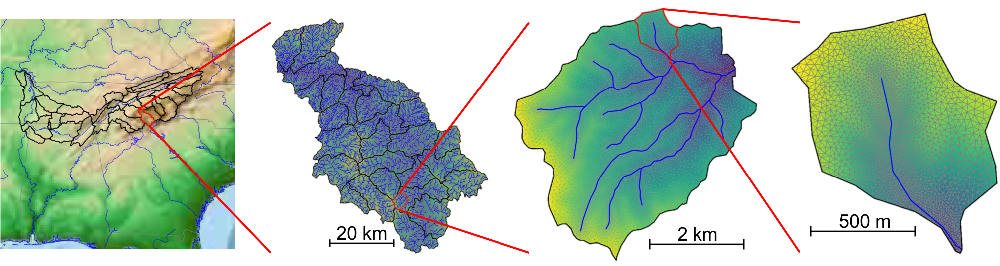

******************
Watershed Workflow
******************

Watershed Workflow is a python-based, open source chain of tools for
generating meshes and other data inputs for hyper-resolution
hydrology, anywhere in the (conterminous + Alaska?) US.

Browse the code at: https://github.com/environmental-modeling-workflow/watershed-workflow/

.. toctree::
   :maxdepth: 2
   :caption: Contents:

   Introduction <intro>
   examples/mesh_coweeta.ipynb
   Installation <install>
   Concepts <concepts>
   API Documentation <api>
   Gallery <gallery>

   
Indices and tables
=====================

* :ref:`genindex`
* :ref:`modindex`
* :ref:`search`

                

